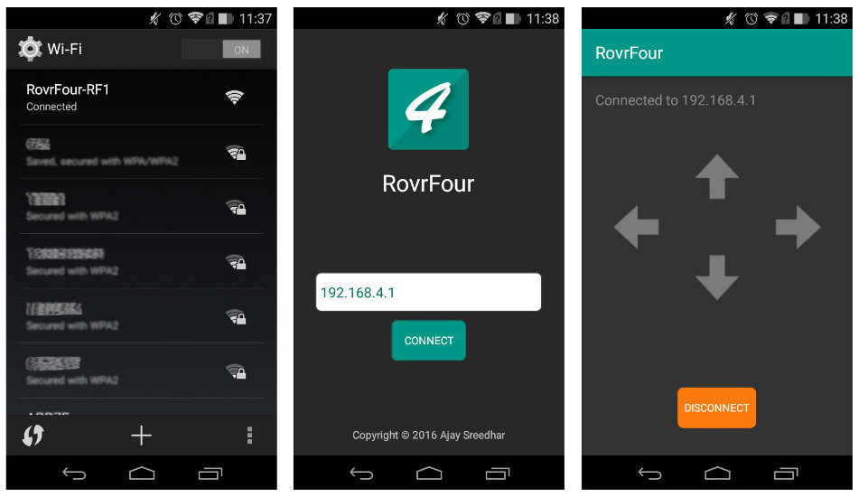

#  RovrFour

> An Android app for operating the Arduino based mini rover RF1 over WiFi.
Read more about [RovrFour RF1 project](https://hackaday.io/project/13059-rovrfour-rf1).

### Development Files
RovrFour is hosted in Github.

https://github.com/ajaysreedhar/rovrfour-controller

### Contributing
If you would like to contribute to RovrFour please read

https://github.com/ajaysreedhar/rovrfour-controller/wiki

### Reporting Issues
Report bugs and other issues at https://github.com/ajaysreedhar/rovrfour-controller/issues

### License
MIT License. Please read the file LICENSE.txt
